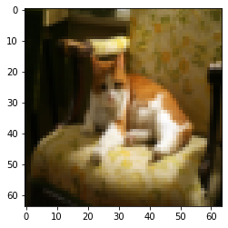
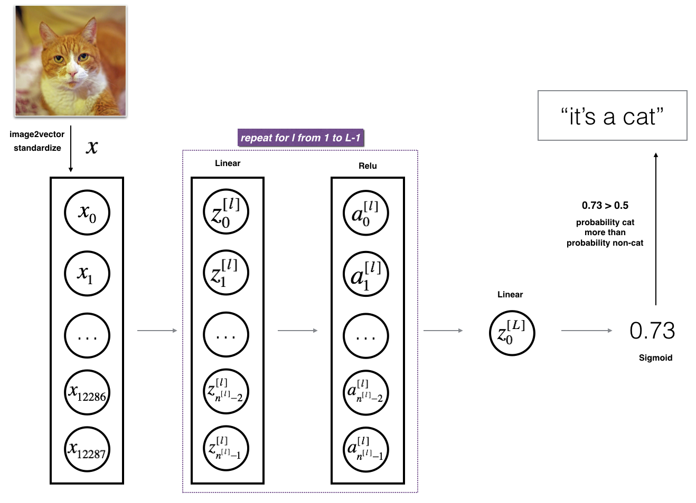
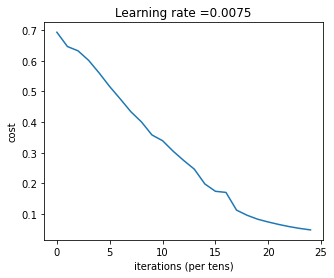
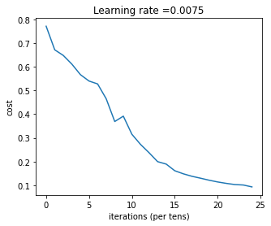
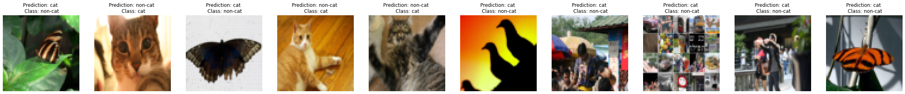

# Deep Neural Network for Image Classification: Application


Welcome!

In this project I am going to build a Deep Neural Network for Image Classification: Application to recognize cats.

**By completion of this project, I've learn how to:** 

- Building the general architecture of a learning algorithm, including:
- Initializing parameters
- Calculating the cost function and its gradient
- Using an optimization algorithm (gradient descent)
- Gather all three functions above into a main model function, in the right order.
- Build and apply a deep neural network to supervised learning. 

Let's get started!

## 1 - Packages

Let's first import all the packages that will need during this project. 
- [numpy](www.numpy.org) is the fundamental package for scientific computing with Python.
- [matplotlib](http://matplotlib.org) is a library to plot graphs in Python.
- [h5py](http://www.h5py.org) is a common package to interact with a dataset that is stored on an H5 file.
- [PIL](http://www.pythonware.com/products/pil/) and [scipy](https://www.scipy.org/) are used here to test your model with own picture at the end.
- dnn_app_utils provides the functions implemented in the "Building the Deep Neural Network: Step by Step" process to this notebook.
- np.random.seed(1) is used to keep all the random function calls consistent.


```python
import time
import numpy as np
import h5py
import matplotlib.pyplot as plt
import scipy
from PIL import Image
from scipy import ndimage
from dnn_app_utils_v2 import *

%matplotlib inline
plt.rcParams['figure.figsize'] = (5.0, 4.0) # set default size of plots
plt.rcParams['image.interpolation'] = 'nearest'
plt.rcParams['image.cmap'] = 'gray'

%load_ext autoreload
%autoreload 2

np.random.seed(1)
```

## 2 - Overview of the Data set ##

**I have a dataset ("train_catvnoncat.h5" and "test_catvnoncat.h5") containing:**
    - a training set of m_train images labeled as cat (y=1) or non-cat (y=0)
    - a test set of m_test images labeled as cat or non-cat
    - each image is of shape (num_px, num_px, 3) where 3 is for the 3 channels (RGB). Thus, each image is square (height = num_px) and (width = num_px).

So, I am going to build a simple image-recognition algorithm that can correctly classify pictures as cat or non-cat.

Let's get more familiar with the dataset. Load the data by running the following code.


```python
train_x_orig, train_y, test_x_orig, test_y, classes = load_data()
```

I have added "_orig" at the end of image datasets (train and test) because I am going to preprocess them. After preprocessing, we will end up with train_set_x and test_set_x (the labels train_set_y and test_set_y don't need any preprocessing).

Each line of the train_set_x_orig and test_set_x_orig is an array representing an image. We can visualize an example by running the following code. Feel free also to change the `index` value and re-run to see other images. 


```python
# Example of a picture
index = 7
plt.imshow(train_x_orig[index])
print ("y = " + str(train_y[0,index]) + ". It's a " + classes[train_y[0,index]].decode("utf-8") +  " picture.")
```

    y = 1. It's a cat picture.


    

    


Many software bugs in deep learning come from having matrix/vector dimensions that don't fit. If you can keep your matrix/vector dimensions straight you will go a long way toward eliminating many bugs. 

So, I am going to find the values for:
    - m_train (number of training examples)
    - m_test (number of test examples)
    - num_px (= height = width of a training image)
Note that `train_set_x_orig` is a numpy-array of shape (m_train, num_px, num_px, 3). For instance, we can access `m_train` by writing `train_set_x_orig.shape[0]`.


```python
# Explore your dataset 
m_train = train_x_orig.shape[0]
num_px = train_x_orig.shape[1]
m_test = test_x_orig.shape[0]

print ("Number of training examples: " + str(m_train))
print ("Number of testing examples: " + str(m_test))
print ("Each image is of size: (" + str(num_px) + ", " + str(num_px) + ", 3)")
print ("train_x_orig shape: " + str(train_x_orig.shape))
print ("train_y shape: " + str(train_y.shape))
print ("test_x_orig shape: " + str(test_x_orig.shape))
print ("test_y shape: " + str(test_y.shape))
```

    Number of training examples: 209
    Number of testing examples: 50
    Each image is of size: (64, 64, 3)
    train_x_orig shape: (209, 64, 64, 3)
    train_y shape: (1, 209)
    test_x_orig shape: (50, 64, 64, 3)
    test_y shape: (1, 50)


For convenience, reshape images of shape (num_px, num_px, 3) in a numpy-array of shape (num_px $*$ num_px $*$ 3, 1). After this, the training (and test) dataset is a numpy-array where each column represents a flattened image. There is m_train (respectively m_test) columns.

Reshaping the training and test data sets so that images of size (num_px, num_px, 3) are flattened into single vectors of shape (num\_px $*$ num\_px $*$ 3, 1).

A trick to flatten a matrix X of shape (a,b,c,d) to a matrix X_flatten of shape (b$*$c$*$d, a) is to use: 
```python
X_flatten = X.reshape(X.shape[0], -1).T      # X.T is the transpose of X
```

As usual, you reshape and standardize the images before feeding them to the network. The code is given in the cell below.


<caption><center> <u>Figure 1</u>: Image to vector conversion. <br> </center></caption>


```python
# Reshape the training and test examples 
train_x_flatten = train_x_orig.reshape(train_x_orig.shape[0], -1).T   # The "-1" makes reshape flatten the remaining dimensions
test_x_flatten = test_x_orig.reshape(test_x_orig.shape[0], -1).T

# Standardize data to have feature values between 0 and 1.
train_x = train_x_flatten/255.
test_x = test_x_flatten/255.

print ("train_x's shape: " + str(train_x.shape))
print ("test_x's shape: " + str(test_x.shape))

```

    train_x's shape: (12288, 209)
    test_x's shape: (12288, 50)


$12,288$ equals $64 \times 64 \times 3$ which is the size of one reshaped image vector.

## 3 - Architecture of your model

Now that we are familiar with the dataset, it is time to build a deep neural network to distinguish cat images from non-cat images.

You will build two different models:
- A 2-layer neural network
- An L-layer deep neural network

I will then compare the performance of these models, and also try out different values for $L$. 

Let's look at the two architectures.

### 3.1 - 2-layer neural network


<caption><center> <u>Figure 2</u>: 2-layer neural network. <br> The model can be summarized as: ***INPUT -> LINEAR -> RELU -> LINEAR -> SIGMOID -> OUTPUT***. </center></caption>

<u>Detailed Architecture of figure 2</u>:
- The input is a (64,64,3) image which is flattened to a vector of size $(12288,1)$. 
- The corresponding vector: $[x_0,x_1,...,x_{12287}]^T$ is then multiplied by the weight matrix $W^{[1]}$ of size $(n^{[1]}, 12288)$.
- Then I will add a bias term and take its relu to get the following vector: $[a_0^{[1]}, a_1^{[1]},..., a_{n^{[1]}-1}^{[1]}]^T$.
- Then I will repeat the same process.
- I will multiply the resulting vector by $W^{[2]}$ and add intercept (bias). 
- Finally, I will take the sigmoid of the result. If it is greater than 0.5, I will classify it to be a cat.

### 3.2 - L-layer deep neural network

It is hard to represent an L-layer deep neural network with the above representation. However, here is a simplified network representation:


<caption><center> <u>Figure 3</u>: L-layer neural network. <br> The model can be summarized as: ***[LINEAR -> RELU] $\times$ (L-1) -> LINEAR -> SIGMOID***</center></caption>

<u>Detailed Architecture of figure 3</u>:
- The input is a (64,64,3) image which is flattened to a vector of size (12288,1).
- The corresponding vector: $[x_0,x_1,...,x_{12287}]^T$ is then multiplied by the weight matrix $W^{[1]}$ and then I will add the intercept $b^{[1]}$. The result is called the linear unit.
- Next, I will take the relu of the linear unit. This process could be repeated several times for each $(W^{[l]}, b^{[l]})$ depending on the model architecture.
- Finally, I will take the sigmoid of the final linear unit. If it is greater than 0.5, I will classify it to be a cat.

### 3.3 - General methodology

As usual I will follow the Deep Learning methodology to build the model:
    1. Initialize parameters / Define hyperparameters
    2. Loop for num_iterations:
        a. Forward propagation
        b. Compute cost function
        c. Backward propagation
        d. Update parameters (using parameters, and grads from backprop) 
    4. Use trained parameters to predict labels

Let's now implement those two models!

## 4 - Two-layer neural network

**Question**:  Use the helper functions you have implemented in the previous assignment to build a 2-layer neural network with the following structure: *LINEAR -> RELU -> LINEAR -> SIGMOID*.

```python
def initialize_parameters(n_x, n_h, n_y):
    ...
    return parameters 
def linear_activation_forward(A_prev, W, b, activation):
    ...
    return A, cache
def compute_cost(AL, Y):
    ...
    return cost
def linear_activation_backward(dA, cache, activation):
    ...
    return dA_prev, dW, db
def update_parameters(parameters, grads, learning_rate):
    ...
    return parameters
```


```python
### CONSTANTS DEFINING THE MODEL ####
n_x = 12288     # num_px * num_px * 3
n_h = 7
n_y = 1
layers_dims = (n_x, n_h, n_y)
```


```python
# GRADED FUNCTION: two_layer_model

def two_layer_model(X, Y, layers_dims, learning_rate = 0.0075, num_iterations = 3000, print_cost=False):
    """
    Implementing a two-layer neural network: LINEAR->RELU->LINEAR->SIGMOID.
    
    Arguments:
    X -- input data, of shape (n_x, number of examples)
    Y -- true "label" vector (containing 0 if cat, 1 if non-cat), of shape (1, number of examples)
    layers_dims -- dimensions of the layers (n_x, n_h, n_y)
    num_iterations -- number of iterations of the optimization loop
    learning_rate -- learning rate of the gradient descent update rule
    print_cost -- If set to True, this will print the cost every 100 iterations 
    
    Returns:
    parameters -- a dictionary containing W1, W2, b1, and b2
    """
    
    np.random.seed(1)
    grads = {}
    costs = []                              # to keep track of the cost
    m = X.shape[1]                           # number of examples
    (n_x, n_h, n_y) = layers_dims
    
    # Initialize parameters dictionary, by calling one of the functions you'd previously implemented
    
    parameters = initialize_parameters(n_x, n_h, n_y)
    
    
    # Get W1, b1, W2 and b2 from the dictionary parameters.
    W1 = parameters["W1"]
    b1 = parameters["b1"]
    W2 = parameters["W2"]
    b2 = parameters["b2"]
    
    # Loop (gradient descent)

    for i in range(0, num_iterations):

        # Forward propagation: LINEAR -> RELU -> LINEAR -> SIGMOID. Inputs: "X, W1, b1". Output: "A1, cache1, A2, cache2".
        
        A1, cache1 =linear_activation_forward(X, W1, b1, activation = "relu")
        A2, cache2 = linear_activation_forward(A1, W2, b2, activation = "sigmoid")
        
        
        # Compute cost
       
        cost = compute_cost(A2, Y)
        
        
        # Initializing backward propagation
        dA2 = - (np.divide(Y, A2) - np.divide(1 - Y, 1 - A2))
        
        # Backward propagation. Inputs: "dA2, cache2, cache1". Outputs: "dA1, dW2, db2; also dA0 (not used), dW1, db1".
        
        dA1, dW2, db2 = linear_activation_backward(dA2, cache2, activation = "sigmoid")
        dA0, dW1, db1 = linear_activation_backward(dA1, cache1, activation = "relu")
        
        
        # Set grads['dWl'] to dW1, grads['db1'] to db1, grads['dW2'] to dW2, grads['db2'] to db2
        grads['dW1'] = dW1
        grads['db1'] = db1
        grads['dW2'] = dW2
        grads['db2'] = db2
        
        # Update parameters.
        
        parameters = update_parameters(parameters, grads, learning_rate)
        

        # Retrieve W1, b1, W2, b2 from parameters
        W1 = parameters["W1"]
        b1 = parameters["b1"]
        W2 = parameters["W2"]
        b2 = parameters["b2"]
        
        # Print the cost every 100 training example
        if print_cost and i % 100 == 0:
            print("Cost after iteration {}: {}".format(i, np.squeeze(cost)))
        if print_cost and i % 100 == 0:
            costs.append(cost)
       
    # plot the cost

    plt.plot(np.squeeze(costs))
    plt.ylabel('cost')
    plt.xlabel('iterations (per tens)')
    plt.title("Learning rate =" + str(learning_rate))
    plt.show()
    
    return parameters
```

Run the cell below to train the parameters. See if the model runs. The cost should be decreasing. It may take up to 5 minutes to run 2500 iterations. Check if the "Cost after iteration 0" matches the expected output below, if not click on the square (⬛) on the upper bar of the notebook to stop the cell and try to find the error.


```python
parameters = two_layer_model(train_x, train_y, layers_dims = (n_x, n_h, n_y), num_iterations = 2500, print_cost=True)
```

    Cost after iteration 0: 0.693049735659989
    Cost after iteration 100: 0.6464320953428849
    Cost after iteration 200: 0.6325140647912678
    Cost after iteration 300: 0.6015024920354665
    Cost after iteration 400: 0.5601966311605748
    Cost after iteration 500: 0.5158304772764731
    Cost after iteration 600: 0.47549013139433266
    Cost after iteration 700: 0.43391631512257495
    Cost after iteration 800: 0.4007977536203886
    Cost after iteration 900: 0.3580705011323798
    Cost after iteration 1000: 0.3394281538366412
    Cost after iteration 1100: 0.3052753636196264
    Cost after iteration 1200: 0.27491377282130164
    Cost after iteration 1300: 0.24681768210614854
    Cost after iteration 1400: 0.19850735037466102
    Cost after iteration 1500: 0.17448318112556638
    Cost after iteration 1600: 0.1708076297809748
    Cost after iteration 1700: 0.11306524562164698
    Cost after iteration 1800: 0.09629426845937156
    Cost after iteration 1900: 0.08342617959726872
    Cost after iteration 2000: 0.07439078704319088
    Cost after iteration 2100: 0.06630748132267937
    Cost after iteration 2200: 0.05919329501038178
    Cost after iteration 2300: 0.05336140348560562
    Cost after iteration 2400: 0.04855478562877024


    

    


Good thing is to built a vectorized implementation! Otherwise it might have taken 10 times longer to train this.

Now, it can use the trained parameters to classify images from the dataset. To see the predictions on the training and test sets, run the cell below.


```python
predictions_train = predict(train_x, train_y, parameters)
```

    Accuracy: 0.9999999999999998


```python
predictions_test = predict(test_x, test_y, parameters)
```

    Accuracy: 0.72


**Note**: You may notice that running the model on fewer iterations (say 1500) gives better accuracy on the test set. This is called "early stopping" and we will talk about it in the next course. Early stopping is a way to prevent overfitting. 

Hmmm! It seems that the 2-layer neural network has better performance (72%) than the logistic regression implementation (70%, assignment week 2). Let's see if it can do even better with an L-layer model.

## 5 - L-layer Neural Network

I am going to use the helper functions you have implemented:

```python
def initialize_parameters_deep(layer_dims):
    ...
    return parameters 
def L_model_forward(X, parameters):
    ...
    return AL, caches
def compute_cost(AL, Y):
    ...
    return cost
def L_model_backward(AL, Y, caches):
    ...
    return grads
def update_parameters(parameters, grads, learning_rate):
    ...
    return parameters
```


```python
### CONSTANTS ###
layers_dims = [12288, 20, 7, 5, 1] #  5-layer model
```


```python
# GRADED FUNCTION: L_layer_model

def L_layer_model(X, Y, layers_dims, learning_rate = 0.0075, num_iterations = 3000, print_cost=False):#lr was 0.009
    """
    Implements a L-layer neural network: [LINEAR->RELU]*(L-1)->LINEAR->SIGMOID.
    
    Arguments:
    X -- data, numpy array of shape (number of examples, num_px * num_px * 3)
    Y -- true "label" vector (containing 0 if cat, 1 if non-cat), of shape (1, number of examples)
    layers_dims -- list containing the input size and each layer size, of length (number of layers + 1).
    learning_rate -- learning rate of the gradient descent update rule
    num_iterations -- number of iterations of the optimization loop
    print_cost -- if True, it prints the cost every 100 steps
    
    Returns:
    parameters -- parameters learnt by the model. They can then be used to predict.
    """

    np.random.seed(1)
    costs = []                         # keep track of cost
    
    # Parameters initialization.
    
    parameters = initialize_parameters_deep(layers_dims)
    
    
    # Loop (gradient descent)
    for i in range(0, num_iterations):

        # Forward propagation: [LINEAR -> RELU]*(L-1) -> LINEAR -> SIGMOID.
        
        AL, caches = L_model_forward(X, parameters)
        
        
        # Compute cost.
        
        cost = compute_cost(AL, Y)
        
    
        # Backward propagation.
        
        grads = L_model_backward(AL, Y, caches)
       
 
        # Update parameters.
        
        parameters = update_parameters(parameters, grads, learning_rate)
       
                
        # Print the cost every 100 training example
        if print_cost and i % 100 == 0:
            print ("Cost after iteration %i: %f" %(i, cost))
        if print_cost and i % 100 == 0:
            costs.append(cost)
            
    # plot the cost
    plt.plot(np.squeeze(costs))
    plt.ylabel('cost')
    plt.xlabel('iterations (per tens)')
    plt.title("Learning rate =" + str(learning_rate))
    plt.show()
    
    return parameters
```

I will now train the model as a 5-layer neural network. 

Run the cell below to train the model. The cost should decrease on every iteration. It may take up to 5 minutes to run 2500 iterations. Check if the "Cost after iteration 0" matches the expected output below, if not click on the square (⬛) on the upper bar of the notebook to stop the cell and try to find the error.


```python
parameters = L_layer_model(train_x, train_y, layers_dims, num_iterations = 2500, print_cost = True)
```

    Cost after iteration 0: 0.771749
    Cost after iteration 100: 0.672053
    Cost after iteration 200: 0.648263
    Cost after iteration 300: 0.611507
    Cost after iteration 400: 0.567047
    Cost after iteration 500: 0.540138
    Cost after iteration 600: 0.527930
    Cost after iteration 700: 0.465477
    Cost after iteration 800: 0.369126
    Cost after iteration 900: 0.391747
    Cost after iteration 1000: 0.315187
    Cost after iteration 1100: 0.272700
    Cost after iteration 1200: 0.237419
    Cost after iteration 1300: 0.199601
    Cost after iteration 1400: 0.189263
    Cost after iteration 1500: 0.161189
    Cost after iteration 1600: 0.148214
    Cost after iteration 1700: 0.137775
    Cost after iteration 1800: 0.129740
    Cost after iteration 1900: 0.121225
    Cost after iteration 2000: 0.113821
    Cost after iteration 2100: 0.107839
    Cost after iteration 2200: 0.102855
    Cost after iteration 2300: 0.100897
    Cost after iteration 2400: 0.092878


    

    


```python
pred_train = predict(train_x, train_y, parameters)
```

    Accuracy: 0.9856459330143539


```python
pred_test = predict(test_x, test_y, parameters)
```

    Accuracy: 0.8


WOW! It seems that the 5-layer neural network has better performance (80%) than the 2-layer neural network (72%) on the same test set. 

This is good performance for this project.

##  6) Results Analysis

First, let's take a look at some images the L-layer model labeled incorrectly. This will show a few mislabeled images. 


```python
print_mislabeled_images(classes, test_x, test_y, pred_test)
```


    

    


**A few type of images the model tends to do poorly on include:** 
- Cat body in an unusual position
- Cat appears against a background of a similar color
- Unusual cat color and species
- Camera Angle
- Brightness of the picture
- Scale variation (cat is very large or small in image) 

## 7) Test with your own image (optional/ungraded exercise) ##

You can use your own image and see the output of your model. To do that:

    1. Click on "File" in the upper bar of this notebook, then click "Open" to go on your Coursera Hub.
    2. Add your image to this Jupyter Notebook's directory, in the "images" folder
    3. Change your image's name in the following code
    4. Run the code and check if the algorithm is right (1 = cat, 0 = non-cat)!


```python

my_image = "my_image.jpg" # change this to the name of your image file 
my_label_y = [1] # the true class of your image (1 -> cat, 0 -> non-cat)


fname = "images/" + my_image
image = np.array(ndimage.imread(fname, flatten=False))
my_image = scipy.misc.imresize(image, size=(num_px,num_px)).reshape((num_px*num_px*3,1))
my_predicted_image = predict(my_image, my_label_y, parameters)

plt.imshow(image)
print ("y = " + str(np.squeeze(my_predicted_image)) + ", your L-layer model predicts a \"" + classes[int(np.squeeze(my_predicted_image)),].decode("utf-8") +  "\" picture.")
```


**References**:

- for auto-reloading external module: http://stackoverflow.com/questions/1907993/autoreload-of-modules-in-ipython
